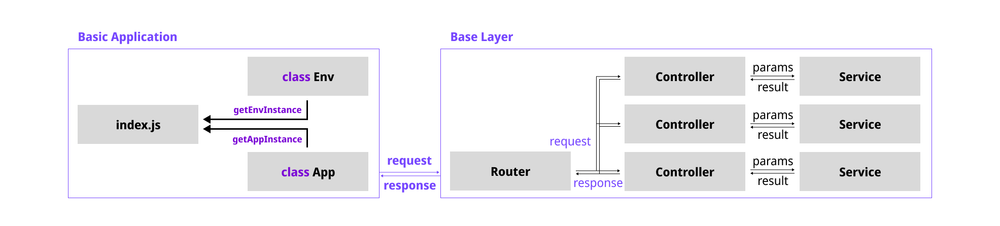

# Welcome 🎉 Base-Express-Layer

This is `Second Step` of [Basic Course](https://github.com/Boiler-Express/.github/blob/main/profile/BASIC-COURSE.md) to dev Express App.

This Template only contain **Basic Application**.
This Template contains...

- **Base Application**
- **Base Layer**

If you want to more information of Architecture, visit [Architecture.md](https://github.com/Boiler-Express/Base-Express-Layer/blob/main/ARCHITECTURE.md)




<hr>

## Get Started, lastest version

```cmd
git clone https://github.com/Boiler-Express/Base-Express-Layer.git
npx degit Boiler-Express/Base-Express-Layer
```

- `git clone` : copy all files, include all versions.
- `npx degit` : copy all files, except versions.

<hr>

## Get Start, selected version

```cmd
<!-- If, you want to clone @1.0.0 / @1.1.0 version -->

git clone -b '@1.0.0' --single-branch --depth 1 https://github.com/Boiler-Express/Base-Express-Layer.git
```

| Versions  | Description   | Updated Date |
| :-------: | :-----------  | :----------- |s


<hr>

## Modules

```json
  "dependencies": {
    "dotenv": "^16.0.1",
    "express": "^4.18.1"
  },
  "devDependencies": {
    "@babel/core": "^7.18.9",     // for testing, with es6.
    "@types/jest": "^28.1.6",     // for testing, with es6.
    "jest": "^28.1.3",            // for testing, with es6.
    "cross-env": "^7.0.3",
    "nodemon": "^2.0.19"
  }
```